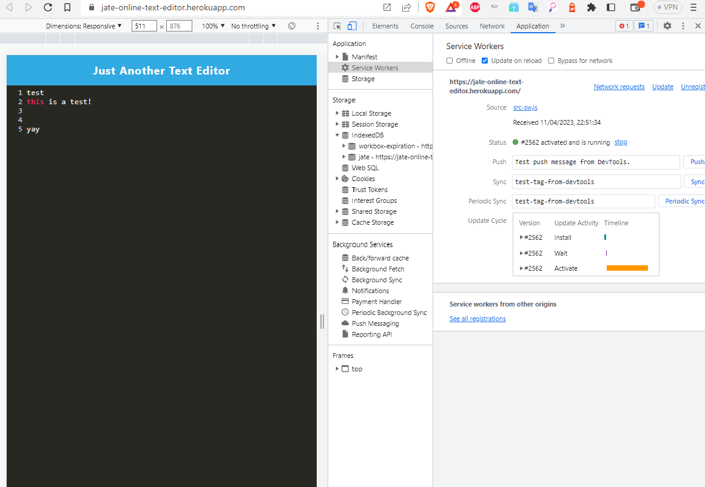

# J.A.T.E (Just Another Text Editor)

A lightweight and user-friendly text editor with auto-save functionality and offline support.

## Description

J.A.T.E (Just Another Text Editor) is a web-based text editor that provides users with a simple and efficient environment to create and edit text files. The app automatically saves the user's text as they type, ensuring that their work is preserved even if they accidentally close the browser or navigate away from the page.

The app is built using HTML, CSS, and JavaScript, with the CodeMirror library for the text editor interface. It also utilizes Workbox and Service Workers to enable offline functionality, ensuring that the app remains available even without an active internet connection. Users can also download the app to their desktop by clicking the "Install!" button.

## Installation

To use J.A.T.E, simply navigate to the following link: https://jate-online-text-editor.herokuapp.com/

No additional installation steps are required.

## Usage

Upon opening the app, users can start typing in the text editor. As they type, the app will automatically save their work. If the user clicks outside of the editor or loses focus, the text will still be saved and available when they return.

The app also functions offline, ensuring that users can continue to work without an active internet connection. To download the app to your desktop, click the "Install!" button in the navigation bar.

## License

MIT License

Copyright (c) [2023] [NikolasTernezis]

Permission is hereby granted, free of charge, to any person obtaining a copy
of this software and associated documentation files (the "Software"), to deal
in the Software without restriction, including without limitation the rights
to use, copy, modify, merge, publish, distribute, sublicense, and/or sell
copies of the Software, and to permit persons to whom the Software is
furnished to do so, subject to the following conditions:

The above copyright notice and this permission notice shall be included in all
copies or substantial portions of the Software.

THE SOFTWARE IS PROVIDED "AS IS", WITHOUT WARRANTY OF ANY KIND, EXPRESS OR
IMPLIED, INCLUDING BUT NOT LIMITED TO THE WARRANTIES OF MERCHANTABILITY,
FITNESS FOR A PARTICULAR PURPOSE AND NONINFRINGEMENT. IN NO EVENT SHALL THE
AUTHORS OR COPYRIGHT HOLDERS BE LIABLE FOR ANY CLAIM, DAMAGES OR OTHER
LIABILITY, WHETHER IN AN ACTION OF CONTRACT, TORT OR OTHERWISE, ARISING FROM,
OUT OF OR IN CONNECTION WITH THE SOFTWARE OR THE USE OR OTHER DEALINGS IN THE
SOFTWARE.